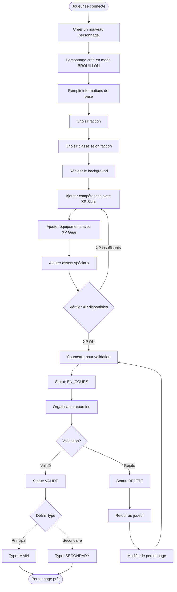
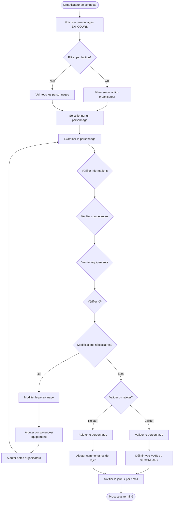
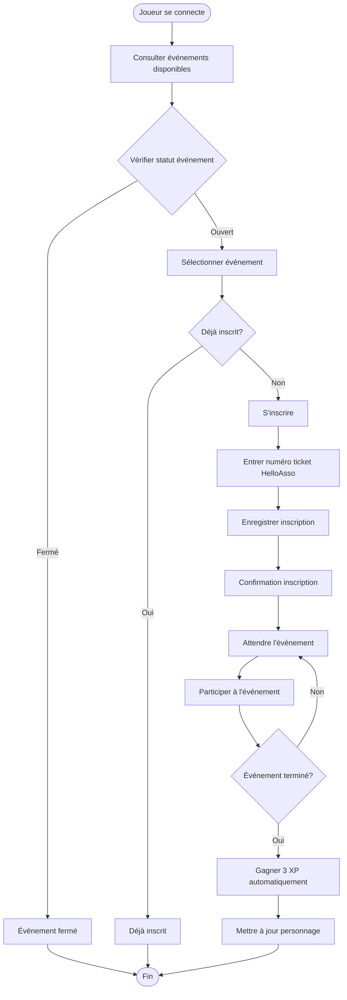
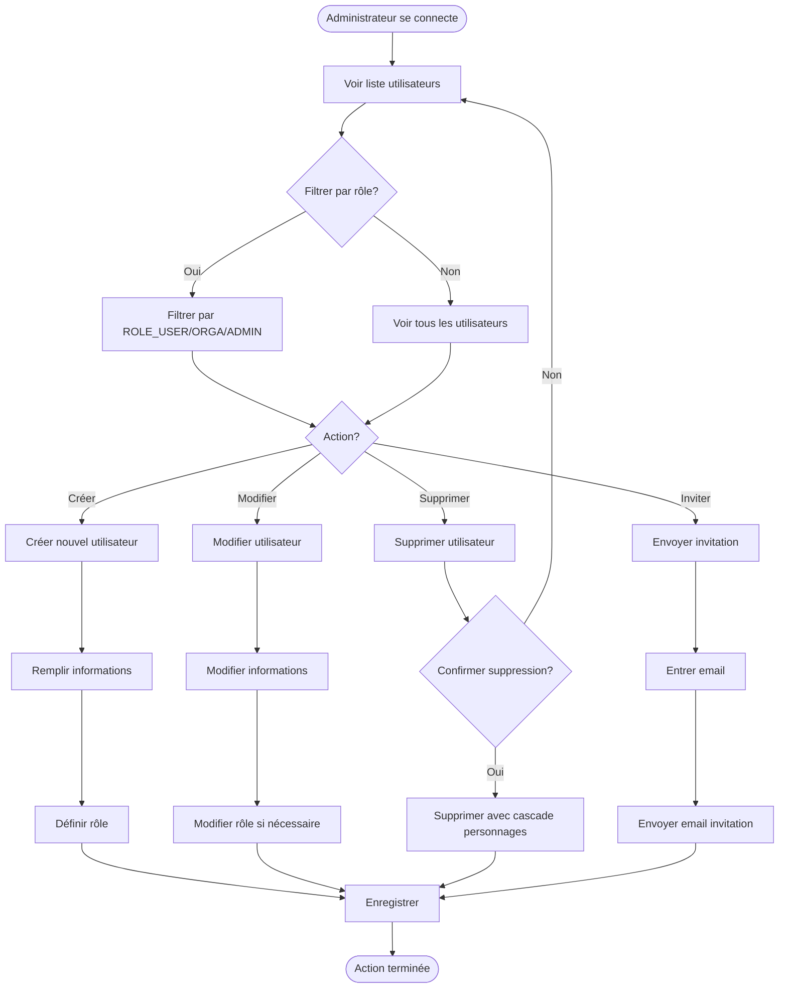

# Workflows de l'application

Cette page décrit les workflows principaux de l'application Dawn GN avec des diagrammes pour faciliter la compréhension.

## Workflow de création de personnage

Ce workflow décrit le processus complet de création d'un personnage par un joueur.

### Étapes détaillées

1. **Création initiale**
   - Le joueur crée un nouveau personnage
   - Le personnage est créé en mode BROUILLON
   - 30 XP de départ sont attribués (20 XP Skills + 10 XP Gear)

2. **Configuration de base**
   - Nom du personnage
   - Choix de la faction (Nomads, Tech'ers, Rodoir, Néo-cuba)
   - Choix de la classe selon la faction
   - Rédaction du background

3. **Ajout de compétences**
   - Consultation du catalogue de compétences
   - Ajout de compétences avec coût en XP Skills
   - Vérification des prérequis (classe, faction, autres compétences)

4. **Ajout d'équipements**
   - Consultation du catalogue d'équipements
   - Ajout d'équipements avec coût en XP Gear
   - Vérification des prérequis

5. **Ajout d'assets**
   - Ajout d'assets spéciaux (capacités, objets)
   - Assets gratuits (coût 0 XP)

6. **Soumission**
   - Vérification des XP disponibles
   - Soumission pour validation
   - Statut passe à EN_COURS

7. **Validation par l'organisateur**
   - L'organisateur examine le personnage
   - Validation ou rejet
   - Si validé, définition du type (MAIN ou SECONDARY)

## Workflow de validation d'un personnage

Ce workflow décrit le processus de validation d'un personnage par un organisateur.

### Étapes détaillées

1. **Consultation**
   - L'organisateur consulte la liste des personnages en validation
   - Filtrage possible par faction

2. **Examen**
   - Vérification des informations du personnage
   - Vérification des compétences et équipements
   - Vérification de la cohérence des XP

3. **Modifications éventuelles**
   - Ajout de compétences/équipements si nécessaire
   - Ajout de notes organisateur
   - Ajustement des XP si nécessaire

4. **Décision**
   - Validation : le personnage devient principal ou secondaire
   - Rejet : le personnage retourne au joueur avec commentaires

5. **Notification**
   - Email automatique au joueur
   - Information sur la validation ou le rejet

## Workflow d'inscription à un événement

Ce workflow décrit le processus d'inscription d'un joueur à un événement Dawn.

### Étapes détaillées

1. **Consultation des événements**
   - Liste des événements Dawn disponibles
   - Statut des événements (ouvert, fermé, caché)

2. **Inscription**
   - Sélection d'un événement ouvert
   - Vérification de non-inscription précédente
   - Enregistrement du numéro de ticket HelloAsso

3. **Participation**
   - Participation à l'événement
   - Après la fin de l'événement, attribution automatique de 3 XP

4. **Mise à jour**
   - Les XP sont ajoutés au personnage principal
   - Disponibilité immédiate pour utilisation

## Workflow de gestion des utilisateurs (Admin)

Ce workflow décrit le processus de gestion des utilisateurs par un administrateur.

### Étapes détaillées

1. **Consultation**
   - Liste de tous les utilisateurs
   - Filtrage possible par rôle

2. **Création**
   - Création d'un nouvel utilisateur
   - Définition du rôle initial
   - Envoi d'invitation optionnel

3. **Modification**
   - Modification des informations utilisateur
   - Changement de rôle si nécessaire

4. **Suppression**
   - Suppression d'un utilisateur
   - Cascade sur les personnages associés

5. **Invitation**
   - Envoi d'invitation par email
   - Génération de lien d'invitation

## Navigation

- [Système de points d'expérience](05-systeme-xp.md)
- [Guide joueur](guides/guide-joueur.md)
- [Guide organisateur](guides/guide-organisateur.md)
