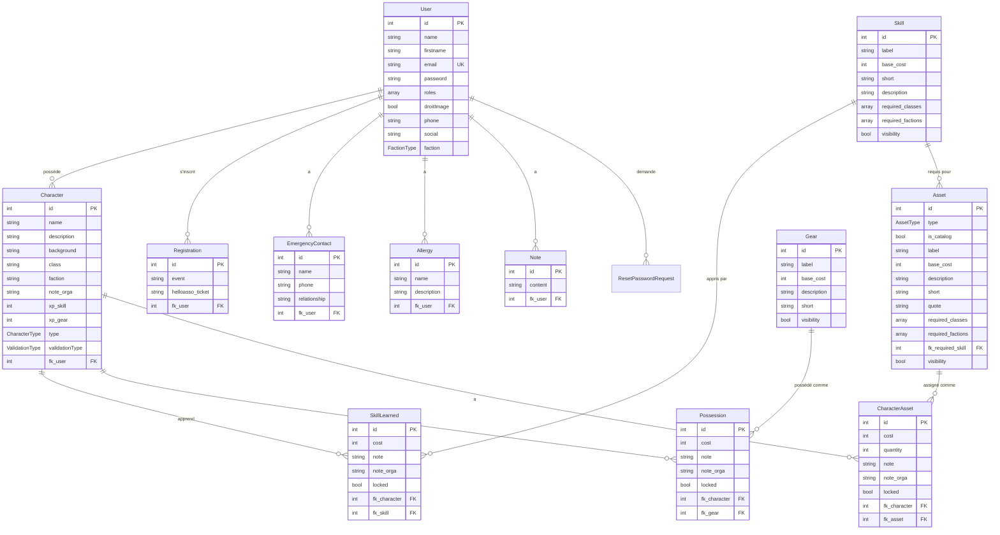

# Structure des entités

Cette page décrit les entités principales de l'application Dawn GN et leurs relations.

## Diagramme de relations

## Entités principales

### User (Utilisateur)

Représente un utilisateur de l'application.

**Propriétés principales :**
- `id` : Identifiant unique
- `name` : Nom de famille
- `firstname` : Prénom
- `email` : Email (unique)
- `password` : Mot de passe hashé
- `roles` : Tableau des rôles (ROLE_USER, ROLE_ORGA, ROLE_ADMIN)
- `droitImage` : Consentement pour l'utilisation d'images
- `phone` : Téléphone
- `social` : Réseaux sociaux
- `faction` : Faction principale (optionnel)

**Relations :**
- `characters` : OneToMany → Character
- `registrations` : OneToMany → Registration
- `emergencyContacts` : OneToMany → EmergencyContact
- `allergies` : OneToMany → Allergy
- `notes` : OneToMany → Note

### Character (Personnage)

Représente un personnage de jeu créé par un joueur.

**Propriétés principales :**
- `id` : Identifiant unique
- `name` : Nom du personnage
- `description` : Description du personnage
- `background` : Histoire et background
- `class` : Classe du personnage (ClassType)
- `faction` : Faction du personnage (FactionType)
- `note_orga` : Notes privées de l'organisateur
- `xp_skill` : Points d'expérience alloués aux compétences
- `xp_gear` : Points d'expérience alloués aux équipements
- `type` : Type de personnage (MAIN, SECONDARY, DRAFT)
- `validationType` : Statut de validation (NON_VALIDE, EN_COURS, VALIDE, REJETE)

**Relations :**
- `user` : ManyToOne → User
- `skillsLearned` : OneToMany → SkillLearned
- `possessions` : OneToMany → Possession
- `characterAssets` : OneToMany → CharacterAsset

**Méthodes utiles :**
- `getAvailableXp()` : Calcule les XP disponibles
- `getSkillsXpUsed()` : Calcule les XP Skills dépensés
- `getGearXpUsed()` : Calcule les XP Gear dépensés
- `getPvMax()` : Calcule les PV maximum
- `getArmor()` : Calcule l'armure
- `getRadiationsOffset()` : Calcule la résistance aux radiations

### Registration (Inscription)

Représente l'inscription d'un joueur à un événement.

**Propriétés principales :**
- `id` : Identifiant unique
- `event` : Type d'événement (EventType)
- `helloasso_ticket` : Numéro de ticket HelloAsso

**Relations :**
- `user` : ManyToOne → User

### Skill (Compétence)

Représente une compétence disponible dans le jeu.

**Propriétés principales :**
- `id` : Identifiant unique
- `label` : Nom de la compétence
- `base_cost` : Coût de base en XP
- `short` : Description courte
- `description` : Description complète
- `required_classes` : Classes requises (tableau)
- `required_factions` : Factions requises (tableau)
- `visibility` : Visibilité dans le catalogue

**Relations :**
- `requiredSkills` : ManyToMany → Skill (prérequis)
- `skillsLearned` : OneToMany → SkillLearned

### SkillLearned (Compétence apprise)

Représente une compétence apprise par un personnage.

**Propriétés principales :**
- `id` : Identifiant unique
- `cost` : Coût réel payé (peut différer du base_cost)
- `note` : Note personnelle du joueur
- `note_orga` : Note de l'organisateur
- `locked` : Verrouillé (non modifiable)

**Relations :**
- `character` : ManyToOne → Character
- `skill` : ManyToOne → Skill

### Gear (Équipement)

Représente un équipement disponible dans le jeu.

**Propriétés principales :**
- `id` : Identifiant unique
- `label` : Nom de l'équipement
- `base_cost` : Coût de base en XP
- `description` : Description complète
- `short` : Description courte
- `visibility` : Visibilité dans le catalogue

**Relations :**
- `possessions` : OneToMany → Possession

### Possession (Possession)

Représente un équipement possédé par un personnage.

**Propriétés principales :**
- `id` : Identifiant unique
- `cost` : Coût réel payé
- `note` : Note personnelle
- `note_orga` : Note de l'organisateur
- `locked` : Verrouillé

**Relations :**
- `character` : ManyToOne → Character
- `gear` : ManyToOne → Gear

### Asset (Asset)

Représente un asset spécial (capacité ou objet).

**Propriétés principales :**
- `id` : Identifiant unique
- `type` : Type d'asset (CAPACITY, OBJECT)
- `is_catalog` : Disponible dans le catalogue
- `label` : Nom de l'asset
- `base_cost` : Coût de base (généralement 0)
- `description` : Description complète
- `short` : Description courte
- `quote` : Citation
- `required_classes` : Classes requises
- `required_factions` : Factions requises
- `required_skill` : Compétence requise
- `visibility` : Visibilité

**Relations :**
- `required_skill` : ManyToOne → Skill
- `characterAssets` : OneToMany → CharacterAsset

### CharacterAsset (Asset de personnage)

Représente un asset assigné à un personnage.

**Propriétés principales :**
- `id` : Identifiant unique
- `cost` : Coût (généralement 0)
- `quantity` : Quantité (pour les objets)
- `note` : Note personnelle
- `note_orga` : Note de l'organisateur
- `locked` : Verrouillé

**Relations :**
- `character` : ManyToOne → Character
- `asset` : ManyToOne → Asset

### EmergencyContact (Contact d'urgence)

Représente un contact d'urgence d'un utilisateur.

**Propriétés principales :**
- `id` : Identifiant unique
- `name` : Nom du contact
- `phone` : Téléphone
- `relationship` : Relation avec l'utilisateur

**Relations :**
- `user` : ManyToOne → User

### Allergy (Allergie)

Représente une allergie d'un utilisateur.

**Propriétés principales :**
- `id` : Identifiant unique
- `name` : Nom de l'allergie
- `description` : Description

**Relations :**
- `user` : ManyToOne → User

### Note (Note)

Représente une note personnelle d'un utilisateur.

**Propriétés principales :**
- `id` : Identifiant unique
- `content` : Contenu de la note

**Relations :**
- `user` : ManyToOne → User

## Enums

### CharacterType
- `MAIN` : Personnage principal
- `SECONDARY` : Personnage secondaire
- `DRAFT` : Brouillon

### ValidationType
- `NON_VALIDE` : Non validé
- `EN_COURS` : En cours de validation
- `VALIDE` : Validé
- `REJETE` : Rejeté

### FactionType
- `NOMADS` : Nomads
- `TECHERS` : Tech'ers
- `RODOIR` : Rodoir
- `NEOCUBA` : Néo-cuba

### AssetType
- `CAPACITY` : Capacité spéciale
- `OBJECT` : Objet

### RoleType
- `ROLE_USER` : Utilisateur standard
- `ROLE_ORGA` : Organisateur
- `ROLE_ADMIN` : Administrateur

## Navigation

- [Architecture technique](03-architecture.md)
- [API et endpoints](07-api.md)
- [Workflows](04-workflows.md)
